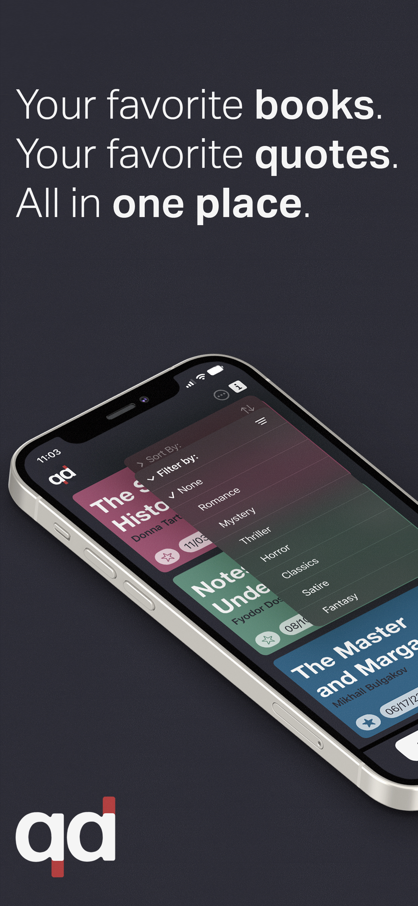
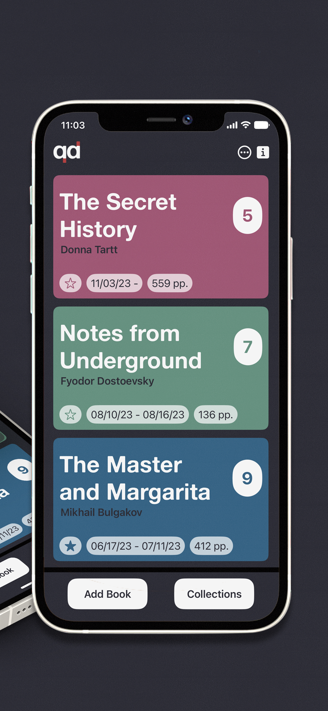

# Quoted

## Description
An iOS application that allows users to effortlessly save, organize, and share quotes from books. The app provides a visually engaging, card-based interface to manage books, quotes, and book collections. Users can manually enter quotes or extract them via image scanning using text recognition, with support for marking favorites, adding page numbers, and annotating thoughts on the quote. Quoted emphasizes smooth user flow, responsive SwiftUI views, and modular components for easy extension.

## Features
- Home screen displays book cards with custom colors, author/title info, page count, reading start and end dates, and number of quotes.
- Image-based text recognition enables seamless extraction of quotes from photos or scanned pages.
- Book detail view shows all recorded quotes and their pagecounts, with theming consistent with the book’s selected color.
- Quote detail view provides a place to edit quotes and jot down annotations about the quote.
- Supports sorting and filtering of books and collections for efficient organization.
- Focused on responsive, intuitive navigation and smooth user experience across multiple views.

## Tech Stack
### Frontend
- **SwiftUI** — Declarative UI framework for interactive and responsive views

### Backend / Persistence
- **Swift** — Application logic, orchestration, and view models
- **Core Data** — Persistent storage and relationship management for books, quotes, and book collections 
- **VisionKit** - Framework for image-based text extraction

## Lookbook
### Home Screen

  
  

